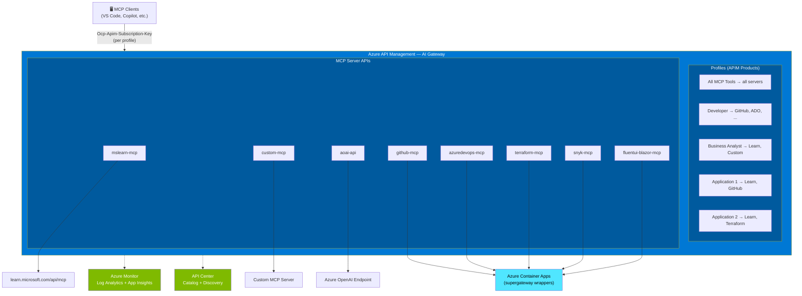

# APIM MCP Gateway

Azure API Management as an **AI Gateway** to expose, govern, and secure MCP (Model Context Protocol) Tools.

## Architecture



## Prerequisites

- Azure subscription
- Azure CLI with Bicep (`az bicep install`)
- Docker Desktop (for building wrapped MCP server images)
- PowerShell 7+ (for post-deployment scripts)
- [Optional] GitHub repository with OIDC federated credentials for CI/CD

## Quick Start

### 1. Configure MCP Servers

Edit [`config/mcp-servers.json`](config/mcp-servers.json) to define the MCP servers to expose through the gateway. Each entry specifies:

| Field | Description |
|-------|-------------|
| `name` | Unique identifier (used in API names and paths) |
| `type` | `third-party`, `custom`, or `azure-openai` |
| `backendUrl` | The actual backend URL to proxy |
| `basePath` | URL path segment on the gateway (e.g., `mslearn-mcp` → `/mslearn-mcp/mcp`) |
| `rateLimitPerMinute` | Requests per minute per MCP session (or IP) |
| `tokensPerMinute` | *(Azure OpenAI only)* Token-based rate limit |

### 2. Configure Profiles

Edit [`config/profiles.json`](config/profiles.json) to define which MCP servers are available per profile. Each profile becomes an APIM Product with its own subscription key.

### 3. Configure Parameters

Edit [`infra/main.bicepparam`](infra/main.bicepparam):

```bicep
param environment = 'dev'
param location = 'westeurope'
param publisherEmail = 'your-email@example.com'
param publisherName = 'Your Organization'

// Optional: Entra ID authentication
param entraIdTenantId = '<your-tenant-id>'
param entraIdClientAppIds = '<your-client-app-id>'

// Feature flags
param deployWrappedServers = true
param deployApiCenter = true
```

### 4. Deploy

```bash
# Create resource group
az group create --name rg-apim-mcp-dev --location westeurope

# Deploy infrastructure
az deployment group create \
  --resource-group rg-apim-mcp-dev \
  --template-file infra/main.bicep \
  --parameters infra/main.bicepparam
```

> **Note:** APIM Developer SKU deployment takes ~30-45 minutes.

### 5. Generate VS Code MCP Config

After deployment, run the post-deployment script to generate `.vscode/mcp.json`:

```powershell
.\scripts\generate-mcp-config.ps1 `
  -ResourceGroupName "rg-apim-mcp-dev" `
  -DeploymentName "main" `
  -SubscriptionKey "<your-subscription-key>"
```

The subscription key can be retrieved from the Azure Portal under **APIM → Subscriptions** → choose the subscription matching your profile.

## API Center

Azure API Center provides a searchable catalog of all MCP Tools. Once deployed (`deployApiCenter = true`), it enables:

- **Web portal**: browse all MCP servers, their descriptions, endpoints, and metadata
- **VS Code extension**: install [Azure API Center](https://marketplace.visualstudio.com/items?itemName=apidev.azure-api-center) to discover APIs directly from your IDE
- **Metadata**: transport type, profile associations, lifecycle stage

Portal URL (after deployment):
```
https://<apic-name>.data.<region>.azure-apicenter.ms
```

## Consumer Guide

For end-users consuming MCP Tools through the gateway, see the full consumer guide:

📖 [docs/consumer-guide.md](docs/consumer-guide.md)

Covers: profiles overview, obtaining subscription keys, VS Code configuration, curl examples, troubleshooting.

## Profiles

Access to MCP APIs is organized by **profiles** (APIM Products). Each profile provides a subscription key giving access to a specific subset of MCP servers.

| Profile | Servers | Approval |
|---------|---------|:--------:|
| **All MCP Tools** | All servers | Required |
| **Developer** | GitHub, Azure DevOps, Terraform, Snyk, Fluent UI Blazor, Azure OpenAI | Auto |
| **Business Analyst** | Microsoft Learn, Custom MCP, Azure OpenAI | Auto |
| **Application 1** | Microsoft Learn, Custom MCP, GitHub, Azure OpenAI | Required |
| **Application 2** | Microsoft Learn, Terraform, Snyk, Azure OpenAI | Required |

Profiles are defined in [`config/profiles.json`](config/profiles.json). Use `"servers": ["*"]` for wildcard (all servers).

## Security Model

### Authentication

| Method | Scope | Configuration |
|--------|-------|---------------|
| **Subscription Keys** | All APIs | Enforced via product (`subscriptionRequired: true`) |
| **Entra ID OAuth 2.1** | Optional | Uncomment `validate-azure-ad-token` in policy XMLs |

### Rate Limiting

- **MCP servers**: Rate-limited per `Mcp-Session-Id` header (fallback to client IP)
- **Azure OpenAI**: Token-based rate limiting via `llm-token-limit` policy

### Logging

All requests are logged to Application Insights with:
- Request/response headers (including `Mcp-Session-Id`)
- Custom metrics: request count, token usage (Azure OpenAI)
- Response body logging disabled for MCP APIs (prevents streaming buffer issues)

## MCP Whitelist Registry

The gateway enforces a **whitelist-based governance model** — only pre-approved MCP servers can be deployed. The registry is version-controlled in GitHub and validated automatically in CI/CD.

### GitHub MCP Allowlist Integration

The gateway generates **MCP Registry v0.1-compatible** JSON files per profile, making it compatible with [GitHub Copilot MCP Allowlisting](https://docs.github.com/en/copilot/customizing-copilot/managing-mcp-servers-for-copilot#allowlisting-mcp-servers) (Business/Enterprise).

Each profile produces its own registry — organizations can assign different registries to different teams, controlling exactly which MCP servers are available in Copilot:

```
output/registry/
  ├── developer/servers.json         → 6 servers (GitHub, ADO, Terraform, Snyk, FluentUI, AOAI)
  ├── business-analyst/servers.json  → 3 servers (Learn, Custom, AOAI)
  ├── app-1/servers.json             → 4 servers
  ├── app-2/servers.json             → 4 servers
  └── all-mcp-tools/servers.json     → All approved servers
```

Generate locally:

```powershell
.\scripts\generate-mcp-registry.ps1 `
  -ApimGatewayUrl "https://<apim-name>.azure-api.net"
```

Configure in GitHub Org Settings → Copilot → Policies → MCP tools → **Registry only** → add the profile registry URL.

The registry is also generated automatically as a CI/CD artifact (`mcp-registry`) on each deployment.

**Files:**
- [`config/mcp-whitelist.json`](config/mcp-whitelist.json) — the whitelist registry (approved/blocked servers, policies)
- [`config/mcp-whitelist.schema.json`](config/mcp-whitelist.schema.json) — JSON Schema for validation
- [`scripts/validate-mcp-whitelist.ps1`](scripts/validate-mcp-whitelist.ps1) — validation script

### What is validated?

| Check | Description |
|-------|-------------|
| **Server approval** | Every server in `mcp-servers.json` must exist in `approvedServers` |
| **Blocked servers** | Servers in `blockedServers` are rejected immediately |
| **Security review** | Review status must be `approved` or `conditional` |
| **Review expiry** | Expired reviews block deployment (configurable) |
| **Rate limits** | Configured rates cannot exceed whitelist maximums |
| **Profile restrictions** | Profile assignments must respect `allowedProfiles` |
| **Primitives config** | `mcpPrimitives` filter consistency (allowList needs `allowed`, denyList needs `denied`) |

### Policies

| Policy | Default | Description |
|--------|---------|-------------|
| `defaultAction` | `deny` | Unlisted servers are denied |
| `requireSecurityReview` | `true` | All servers need a security review |
| `maxReviewValidityDays` | `180` | Reviews expire after 6 months |
| `autoBlockOnExpiredReview` | `true` | Auto-block on expired review |
| `allowUnreviewedInDev` | `false` | Allow unreviewed in dev only |
| `notifyOnExpiringSoon` | `30` | Warn 30 days before expiry |

### Manual validation

```powershell
# Default (dev environment)
.\scripts\validate-mcp-whitelist.ps1

# Production with strict mode (warnings = errors)
.\scripts\validate-mcp-whitelist.ps1 -Environment prod -Strict
```

### MCP Primitives Filtering

Beyond server-level approval, the gateway supports **granular filtering** of MCP primitives (tools, prompts, resources) per server. This is enforced at the APIM policy level via JSON-RPC body inspection.

#### Filter policies

| Policy | Behavior |
|--------|----------|
| `allowAll` | All primitives pass through (default) |
| `denyAll` | All primitives are blocked |
| `allowList` | Only listed primitives are allowed |
| `denyList` | Listed primitives are blocked, rest allowed |

#### Configuration example

In `config/mcp-whitelist.json`, add `mcpPrimitives` to a server entry:

```json
{
  "name": "github-mcp",
  "mcpPrimitives": {
    "tools": {
      "policy": "denyList",
      "denied": ["delete_repository", "delete_branch", "delete_file"],
      "reason": "Destructive operations blocked."
    },
    "prompts": { "policy": "allowAll" },
    "resources": { "policy": "allowAll" }
  }
}
```

Servers without `mcpPrimitives` use defaults from `policies.mcpPrimitivesDefaults` (`allowAll` for all types).

Wildcard patterns are supported: `secret://*`, `delete_*`.

Blocked calls return a JSON-RPC error `{ code: -32600 }` with a governance message. Discovery methods (`tools/list`, etc.) are never filtered.

## Adding a New MCP Server

### HTTP/Streamable HTTP servers

1. Add the server to [`config/mcp-whitelist.json`](config/mcp-whitelist.json) with a security review
2. Add an entry to [`config/mcp-servers.json`](config/mcp-servers.json)
3. Run whitelist validation: `.\scripts\validate-mcp-whitelist.ps1`
4. Redeploy the infrastructure (`az deployment group create ...`)
5. Re-run the config generation script

### stdio servers (wrapped via supergateway)

For MCP servers that only support stdio transport (e.g. GitHub, Terraform, Snyk), the gateway uses **supergateway** to wrap them in Streamable HTTP containers deployed on Azure Container Apps.

See the full guide: [docs/stdio-to-http-guide.md](docs/stdio-to-http-guide.md)

Quick steps:
1. Add the server to [`config/mcp-whitelist.json`](config/mcp-whitelist.json) with a security review
2. Create a `docker/<server-name>/Dockerfile` using the supergateway pattern
3. Add config to `config/wrapped-mcp-servers.json` and `config/mcp-servers.json`
4. Run whitelist validation: `.\scripts\validate-mcp-whitelist.ps1`
5. Build and push: `.\scripts\build-push-images.ps1 -ResourceGroupName "rg-apim-mcp-dev" -AcrName "apimmcpdevacr"`
6. Redeploy infrastructure

### Currently wrapped servers

| Server | Transport | Auth Required |
|--------|-----------|---------------|
| GitHub MCP | stdio → Streamable HTTP | `GITHUB_PERSONAL_ACCESS_TOKEN` |
| Azure DevOps MCP | stdio → Streamable HTTP | `AZURE_DEVOPS_PAT` |
| Terraform MCP | stdio → Streamable HTTP | None |
| Snyk MCP | stdio → Streamable HTTP | `SNYK_TOKEN` |
| Fluent UI Blazor MCP | stdio → Streamable HTTP | None |

## Project Structure

```
├── .vscode/mcp.json              # Workspace MCP config → APIM gateway URLs
├── .github/workflows/deploy.yml  # GitHub Actions CI/CD
├── infra/
│   ├── main.bicep                # Main orchestrator
│   ├── main.bicepparam           # Parameters
│   └── modules/                  # Bicep modules (APIM, ACR, Container Apps, etc.)
├── docker/                       # Dockerfiles for wrapped stdio MCP servers
│   ├── github-mcp/
│   ├── azuredevops-mcp/
│   ├── terraform-mcp/
│   ├── snyk-mcp/
│   └── fluentui-blazor-mcp/
├── policies/                     # APIM XML policies
│   ├── mcp-passthrough-policy.xml  # MCP API policy (rate limit, trace, primitives filter)
│   ├── mcp-primitives-filter.xml   # Standalone primitives filter policy fragment
│   ├── aoai-policy.xml
│   └── global-policy.xml
├── config/
│   ├── mcp-servers.json          # MCP server registry (APIM backends)
│   ├── mcp-whitelist.json        # MCP whitelist registry (approved/blocked servers)
│   ├── mcp-whitelist.schema.json # JSON Schema for whitelist validation
│   ├── profiles.json             # Profile definitions (APIM products per role)
│   └── wrapped-mcp-servers.json  # Wrapped stdio server definitions (Container Apps)
├── scripts/                      # Deployment and build scripts
│   ├── generate-mcp-config.ps1
│   ├── generate-mcp-registry.ps1  # Generate MCP Registry v0.1 per profile
│   ├── validate-mcp-whitelist.ps1 # Whitelist validation script
│   └── build-push-images.ps1
└── docs/
    ├── architecture.md           # Detailed architecture documentation
    ├── consumer-guide.md         # End-user guide for consuming MCP Tools
    └── stdio-to-http-guide.md    # Guide for wrapping stdio MCP servers
```

## CI/CD

The GitHub Actions workflow (`.github/workflows/deploy.yml`) uses OIDC federation for passwordless Azure authentication.

The pipeline includes a **whitelist validation** step that runs before Bicep validation. In `prod` environment, `-Strict` mode is enabled (warnings are treated as errors).

Required secrets:

| Secret | Description |
|--------|-------------|
| `AZURE_CLIENT_ID` | App registration client ID |
| `AZURE_TENANT_ID` | Entra ID tenant ID |
| `AZURE_SUBSCRIPTION_ID` | Target subscription ID |

See [docs/architecture.md](docs/architecture.md) for the full architecture documentation.

## License

MIT
