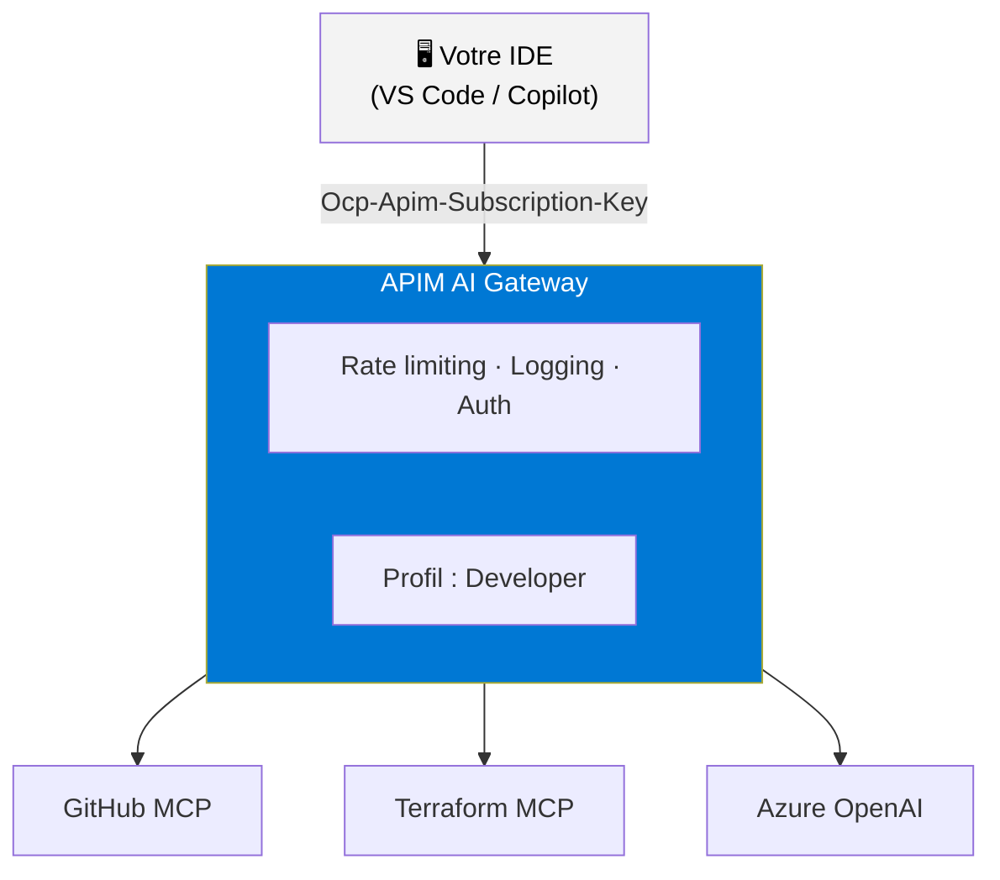
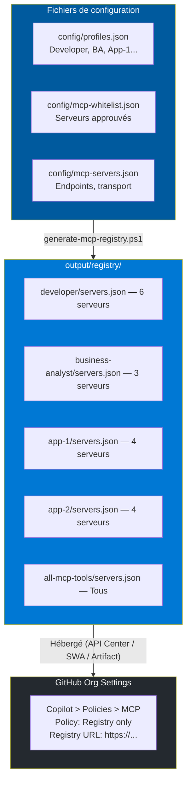

# Guide du consommateur — MCP AI Gateway

Ce guide explique comment utiliser les MCP Tools exposés via l'AI Gateway (Azure API Management) dans vos outils de développement.

## Table des matières

- [Vue d'ensemble](#vue-densemble)
- [Profils disponibles](#profils-disponibles)
- [Whitelist des serveurs MCP](#whitelist-des-serveurs-mcp)
- [Filtrage des primitives MCP](#filtrage-des-primitives-mcp)
- [Obtenir votre clé d'accès](#obtenir-votre-clé-daccès)
- [Configuration VS Code](#configuration-vs-code)
- [Configuration GitHub Copilot](#configuration-github-copilot)
- [Catalogue API Center](#catalogue-api-center)
- [GitHub MCP Registry (Allowlist)](#github-mcp-registry-allowlist)
- [Référence des endpoints](#référence-des-endpoints)
- [Exemples d'utilisation](#exemples-dutilisation)
- [Dépannage](#dépannage)

---

## Vue d'ensemble

L'AI Gateway centralise l'accès à tous les serveurs MCP (Model Context Protocol) de l'organisation. Au lieu de configurer chaque serveur individuellement, vous accédez à tout via un point d'entrée unique avec :

- **Authentification unifiée** : une seule clé d'abonnement (subscription key)
- **Gouvernance** : rate limiting, logging, métriques
- **Sécurité** : validation Entra ID optionnelle, TLS 1.2+
- **Découverte** : catalogue API Center pour explorer les MCP disponibles



---

## Profils disponibles

L'accès aux MCP Tools est organisé par **profils**. Chaque profil regroupe un ensemble de serveurs MCP adaptés à un rôle ou une application.

| Profil | Description | MCP Servers inclus | Approbation |
|--------|-------------|--------------------|:-----------:|
| **All MCP Tools** | Accès complet — administrateurs et platform teams | Tous les serveurs | ✅ Requise |
| **Developer** | Outils de développement et DevOps | GitHub, Azure DevOps, Terraform, Snyk, Fluent UI Blazor, Azure OpenAI | ❌ Auto |
| **Business Analyst** | Documentation et IA | Microsoft Learn, Custom MCP, Azure OpenAI | ❌ Auto |
| **Application 1** | Périmètre Application 1 | Microsoft Learn, Custom MCP, GitHub, Azure OpenAI | ✅ Requise |
| **Application 2** | Périmètre Application 2 | Microsoft Learn, Terraform, Snyk, Azure OpenAI | ✅ Requise |

> **💡 Besoin d'un autre profil ?** Contactez l'équipe plateforme pour créer un profil personnalisé.

---

## Whitelist des serveurs MCP

Tous les serveurs MCP exposés via le gateway sont soumis à un processus de **whitelisting** avant d'être disponibles. Ce registre est versionné dans GitHub et validé automatiquement à chaque déploiement.

### Pourquoi un whitelist ?

- **Sécurité** : chaque serveur MCP subit une revue de sécurité avant approbation
- **Traçabilité** : historique complet des approbations via Git
- **Gouvernance** : les revues expirent automatiquement (180 jours par défaut)
- **Conformité** : les serveurs bloqués (CVE, vulnérabilités) sont rejetés en CI/CD

### Statuts possibles

| Statut | Description |
|--------|-------------|
| ✅ `approved` | Serveur approuvé — peut être déployé |
| ⚠️ `conditional` | Approuvé sous conditions (restrictions spécifiques) |
| ⏳ `pending` | En attente de revue — bloqué en prod |
| ❌ `rejected` | Rejeté — ne peut pas être déployé |
| 🚫 `blocked` | Serveur dans la liste noire (ex : CVE connue) |

### Demander l'ajout d'un nouveau serveur MCP

1. Ouvrez une **Pull Request** sur le dépôt GitHub
2. Ajoutez le serveur dans `config/mcp-whitelist.json` → section `approvedServers`
3. Remplissez la section `securityReview` (publisher, source, niveau de risque)
4. La CI/CD validera automatiquement le format
5. L'équipe sécurité effectuera la revue avant approbation

### Consulter le registre

Le registre complet est disponible dans [`config/mcp-whitelist.json`](../config/mcp-whitelist.json). Chaque entrée contient :

| Champ | Description |
|-------|-------------|
| `publisher` | Éditeur du serveur MCP |
| `source` | URL ou identifiant npm du package |
| `sourceType` | `managed-service`, `internal`, `open-source`, `commercial` |
| `securityReview.riskLevel` | `low`, `medium`, `high`, `critical` |
| `securityReview.nextReviewDate` | Date de la prochaine revue obligatoire |
| `restrictions` | Rate limits max, profils autorisés, secrets requis |

---

## Filtrage des primitives MCP

Au-delà du contrôle au niveau serveur (approved/blocked), le gateway permet un **filtrage granulaire** des primitives MCP : **tools**, **prompts** et **resources**.

### Pourquoi filtrer les primitives ?

Un serveur MCP peut exposer des dizaines de tools. Certains peuvent être destructeurs (ex. `delete_repository`) ou exposer des données sensibles (ex. `secret://*`). Le filtrage permet d'approuver un serveur tout en bloquant les opérations à risque.

### Politiques disponibles

| Politique | Comportement |
|-----------|-------------|
| `allowAll` | Toutes les primitives sont autorisées (par défaut) |
| `denyAll` | Toutes les primitives sont bloquées |
| `allowList` | Seules les primitives listées dans `allowed` sont autorisées |
| `denyList` | Les primitives listées dans `denied` sont bloquées, le reste est autorisé |

### Exemples configurés

**GitHub MCP** — bloque les opérations destructrices :
```json
{
  "tools": {
    "policy": "denyList",
    "denied": ["delete_repository", "delete_branch", "delete_file"],
    "reason": "Destructive operations blocked by governance policy."
  }
}
```

**Azure DevOps MCP** — n'autorise que les opérations en lecture :
```json
{
  "tools": {
    "policy": "allowList",
    "allowed": ["get_work_item", "list_work_items", "list_pull_requests", "..."],
    "reason": "Only read operations allowed."
  },
  "resources": {
    "policy": "denyList",
    "denied": ["secret://*"],
    "reason": "Secret resources blocked for security."
  }
}
```

### Comportement en cas de blocage

Si un tool, prompt ou resource est bloqué, le gateway retourne une erreur JSON-RPC :

```json
{
  "jsonrpc": "2.0",
  "id": 1,
  "error": {
    "code": -32600,
    "message": "Blocked by governance policy: tools/delete_repository is not allowed on this gateway."
  }
}
```

> **Note :** Les méthodes de découverte (`tools/list`, `prompts/list`, `resources/list`) ne sont pas filtrées — la liste complète est toujours visible. Seule l'exécution est bloquée.

### Wildcards

Le filtrage supporte les wildcards en fin de pattern :
- `secret://*` → bloque toutes les URIs commençant par `secret://`
- `delete_*` → bloque tous les tools commençant par `delete_`

---

## Obtenir votre clé d'accès

### Option 1 : Portail Azure

1. Accédez au portail Azure → **API Management** → votre instance
2. Menu gauche → **Subscriptions**
3. Trouvez l'abonnement correspondant à votre profil (ex : `Developer - Default Subscription`)
4. Cliquez sur **Show/Hide keys** → copiez la **Primary key**

### Option 2 : Azure CLI

```bash
# Lister les abonnements APIM
az apim subscription list \
  --resource-group rg-apim-mcp-dev \
  --service-name apim-mcp-dev-apim \
  --output table

# Afficher la clé d'un abonnement spécifique
az apim subscription keys show \
  --resource-group rg-apim-mcp-dev \
  --service-name apim-mcp-dev-apim \
  --subscription-id developer-default-sub
```

### Option 3 : Portail développeur APIM

Si activé, accédez au portail développeur :
```
https://<apim-name>.developer.azure-api.net
```
Connectez-vous avec votre compte Entra ID, accédez à **Profil** → **Subscriptions**.

---

## Configuration VS Code

### Configuration automatique (recommandé)

Après le déploiement, lancez le script de génération :

```powershell
.\scripts\generate-mcp-config.ps1 `
  -ResourceGroupName "rg-apim-mcp-dev" `
  -DeploymentName "main" `
  -SubscriptionKey "<votre-subscription-key>"
```

Le fichier `.vscode/mcp.json` sera généré automatiquement.

### Configuration manuelle

Créez ou modifiez `.vscode/mcp.json` dans votre workspace :

```json
{
  "servers": {
    "github-mcp-gateway": {
      "type": "http",
      "url": "https://<apim-name>.azure-api.net/github-mcp/mcp",
      "headers": {
        "Ocp-Apim-Subscription-Key": "<votre-subscription-key>"
      }
    },
    "terraform-mcp-gateway": {
      "type": "http",
      "url": "https://<apim-name>.azure-api.net/terraform-mcp/mcp",
      "headers": {
        "Ocp-Apim-Subscription-Key": "<votre-subscription-key>"
      }
    }
  }
}
```

> **Important** : N'ajoutez que les serveurs inclus dans votre profil. Les autres retourneront une erreur `401 Unauthorized`.

### Utilisation d'inputs pour protéger la clé

Pour ne pas stocker la clé en clair dans le fichier :

```json
{
  "inputs": [
    {
      "id": "apimSubscriptionKey",
      "type": "promptString",
      "description": "Clé d'abonnement APIM AI Gateway",
      "password": true
    }
  ],
  "servers": {
    "github-mcp-gateway": {
      "type": "http",
      "url": "https://<apim-name>.azure-api.net/github-mcp/mcp",
      "headers": {
        "Ocp-Apim-Subscription-Key": "${input:apimSubscriptionKey}"
      }
    }
  }
}
```

VS Code demandera la clé au premier appel.

---

## Configuration GitHub Copilot

GitHub Copilot utilise les serveurs MCP configurés dans `.vscode/mcp.json`. Une fois le fichier configuré (voir section précédente), les outils MCP apparaissent automatiquement dans Copilot Chat.

Pour vérifier :
1. Ouvrez Copilot Chat (`Ctrl+Shift+I`)
2. Cliquez sur l'icône **outils** (🔧) en bas du chat
3. Les serveurs MCP gateway doivent apparaître dans la liste

---

## Catalogue API Center

Azure API Center fournit un catalogue centralisé de tous les MCP Tools disponibles.

### Portail web

Accédez au portail API Center :
```
https://<apic-name>.data.<region>.azure-apicenter.ms
```

Vous y trouverez :
- La liste de tous les MCP servers disponibles
- Leur description et documentation
- Les endpoints de la gateway
- Les métadonnées (transport, profils associés)

### Extension VS Code

Installez l'extension **Azure API Center** dans VS Code :

1. Ouvrez VS Code → Extensions → rechercher **Azure API Center**
2. Installez l'extension
3. Connectez-vous à votre compte Azure
4. L'arborescence API Center apparaît dans le panneau Azure
5. Parcourez les APIs disponibles, consultez les détails

L'extension permet de :
- **Découvrir** les MCP servers disponibles
- **Voir** les endpoints et la documentation
- **Générer** des snippets de configuration

---

## GitHub MCP Registry (Allowlist)

Le gateway s'intègre avec le système **MCP Allowlist** de GitHub Copilot (Business/Enterprise). Chaque **profil** génère un registre MCP Registry v0.1 distinct, permettant de contrôler quels serveurs MCP sont autorisés par équipe.

### Comment ça fonctionne ?



### Générer le registre localement

```powershell
# Générer les fichiers de registre pour tous les profils
.\scripts\generate-mcp-registry.ps1 `
  -ConfigPath "./config" `
  -OutputPath "./output/registry" `
  -ApimGatewayUrl "https://<apim-name>.azure-api.net"
```

Cela produit un fichier `servers.json` par profil + les fichiers de version par serveur :

```
output/registry/
  ├── developer/
  │   ├── servers.json
  │   └── servers/<server-id>/versions/
  │       ├── latest.json
  │       └── 1.0.0.json
  ├── business-analyst/
  │   └── ...
  └── ...
```

### Configurer GitHub Copilot MCP Allowlist

1. **Hébergez le registre** (Azure API Center, Static Web App ou GitHub Pages)
2. Accédez à **GitHub Org Settings** → **Copilot** → **Policies** → **MCP tools**
3. Activez la politique : **Registry only**
4. Ajoutez l'URL du registre correspondant au profil de l'équipe :
   - Devs : `https://<host>/developer/`
   - Analystes : `https://<host>/business-analyst/`
   - App 1 : `https://<host>/app-1/`
5. Les développeurs ne pourront utiliser que les serveurs MCP présents dans leur registre

### Configurer via VS Code Enterprise Policy

Pour forcer la configuration via une policy managée (GPO/Intune) :

```json
{
  "github.copilot.chat.mcp.policy": "registryOnly",
  "github.copilot.chat.mcp.registryUrl": "https://<host>/developer/"
}
```

> **Note** : Le registre est régénéré automatiquement à chaque déploiement via le pipeline CI/CD. L'artefact `mcp-registry` est disponible dans les artifacts GitHub Actions.

---

## Référence des endpoints

Chaque serveur MCP est exposé via la gateway à l'URL suivante :

```
https://<apim-name>.azure-api.net/<basePath>/mcp
```

### Serveurs MCP disponibles

| Serveur | Base Path | Type | Description |
|---------|-----------|------|-------------|
| Microsoft Learn | `mslearn-mcp` | Documentation | Recherche et consultation de la documentation Microsoft Learn |
| Custom MCP | `custom-mcp` | Interne | Serveur MCP interne personnalisé |
| Azure OpenAI | `aoai-api` | IA | Complétions de chat et embeddings via Azure OpenAI |
| GitHub | `github-mcp` | DevOps | Opérations GitHub (repos, issues, PRs, fichiers) |
| Azure DevOps | `azuredevops-mcp` | DevOps | Opérations Azure DevOps (work items, repos, pipelines) |
| Terraform | `terraform-mcp` | IaC | Documentation des providers et ressources Terraform |
| Snyk | `snyk-mcp` | Sécurité | Scan de vulnérabilités et analyse de sécurité |
| Fluent UI Blazor | `fluentui-blazor-mcp` | UI | Documentation des composants Fluent UI Blazor |

### Headers requis

| Header | Requis | Description |
|--------|:------:|-------------|
| `Ocp-Apim-Subscription-Key` | ✅ | Clé d'abonnement associée à votre profil |
| `Content-Type` | ✅ | `application/json` pour les requêtes POST |
| `Accept` | Recommandé | `application/json, text/event-stream` |
| `Mcp-Session-Id` | Auto | Géré automatiquement par le client MCP |

---

## Exemples d'utilisation

### Test rapide avec curl

```bash
# Initialiser une session MCP via la gateway
curl -X POST "https://<apim-name>.azure-api.net/github-mcp/mcp" \
  -H "Content-Type: application/json" \
  -H "Ocp-Apim-Subscription-Key: <votre-clé>" \
  -d '{
    "jsonrpc": "2.0",
    "id": 1,
    "method": "initialize",
    "params": {
      "protocolVersion": "2025-03-26",
      "capabilities": {},
      "clientInfo": { "name": "test-client", "version": "1.0.0" }
    }
  }'
```

### Lister les outils disponibles

```bash
curl -X POST "https://<apim-name>.azure-api.net/github-mcp/mcp" \
  -H "Content-Type: application/json" \
  -H "Ocp-Apim-Subscription-Key: <votre-clé>" \
  -H "Mcp-Session-Id: <session-id-from-initialize>" \
  -d '{
    "jsonrpc": "2.0",
    "id": 2,
    "method": "tools/list"
  }'
```

### Lister les resources MCP

```bash
curl -X POST "https://<apim-name>.azure-api.net/github-mcp/mcp" \
  -H "Content-Type: application/json" \
  -H "Ocp-Apim-Subscription-Key: <votre-clé>" \
  -H "Mcp-Session-Id: <session-id-from-initialize>" \
  -d '{
    "jsonrpc": "2.0",
    "id": 3,
    "method": "resources/list"
  }'
```

### Lister les prompts MCP

```bash
curl -X POST "https://<apim-name>.azure-api.net/github-mcp/mcp" \
  -H "Content-Type: application/json" \
  -H "Ocp-Apim-Subscription-Key: <votre-clé>" \
  -H "Mcp-Session-Id: <session-id-from-initialize>" \
  -d '{
    "jsonrpc": "2.0",
    "id": 4,
    "method": "prompts/list"
  }'
```

---

## Dépannage

| Problème | Cause possible | Solution |
|----------|---------------|----------|
| `401 Unauthorized` | Clé d'abonnement invalide ou manquante | Vérifiez le header `Ocp-Apim-Subscription-Key` |
| `401 Unauthorized` | API non incluse dans votre profil | Demandez un abonnement au profil incluant ce serveur |
| `403 Forbidden` | Validation Entra ID activée, token manquant | Ajoutez un token Bearer dans le header `Authorization` |
| `429 Too Many Requests` | Rate limit dépassé (par session MCP) | Attendez et réessayez. Contactez l'admin pour augmenter le quota |
| `500 Internal Server Error` | Le serveur MCP backend est indisponible | Vérifiez l'état de santé du Container App ou serveur backend |
| Timeout | Réponse trop longue du serveur backend | Le timeout APIM est de 30s par défaut. Contactez l'admin si nécessaire |
| Serveur non listé | Le serveur n'est pas encore déployé | Consultez le catalogue API Center ou contactez l'équipe plateforme |

### Vérifier la connectivité

```bash
# Tester la gateway APIM
curl -I "https://<apim-name>.azure-api.net/status-0123456789abcdef"
# Doit retourner HTTP 200

# Tester un endpoint MCP (GET pour Streamable HTTP)
curl "https://<apim-name>.azure-api.net/github-mcp/mcp" \
  -H "Ocp-Apim-Subscription-Key: <votre-clé>"
```

### Contacter le support

Pour toute demande (nouveau profil, accès supplémentaire, problème technique) :
- Créez un ticket dans Azure DevOps ou GitHub Issues
- Incluez : votre profil actuel, le serveur MCP concerné, le message d'erreur complet
