# Executive Summary — APIM MCP AI Gateway

> **Document destiné aux équipes Architecture et Sécurité**
> Version 1.0 — Mars 2026

---

## 1. Contexte et objectifs

Le protocole **MCP (Model Context Protocol)** permet aux assistants IA (GitHub Copilot, VS Code, agents IA) d'accéder à des outils et données externes via des **serveurs MCP**. Sans gouvernance, chaque développeur configure ses propres serveurs MCP, créant des risques de sécurité, de shadow IT et d'absence de traçabilité.

**L'APIM MCP AI Gateway** centralise l'accès à tous les serveurs MCP de l'organisation via **Azure API Management**, offrant :

- Un **point d'entrée unique** sécurisé
- Un contrôle d'accès **par profil métier** (RBAC applicatif)
- Une **gouvernance complète** (whitelist, revues de sécurité, filtrage des primitives)
- Une **observabilité totale** (métriques, traces, logs)

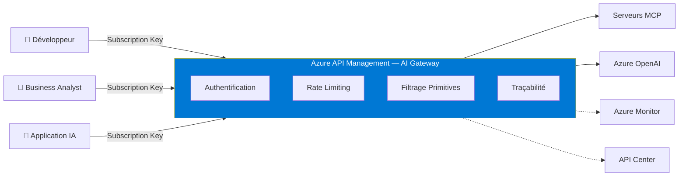

---

## 2. Architecture déployée

### 2.1 Vue d'ensemble

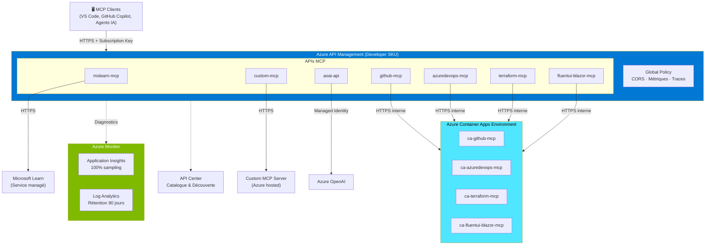

### 2.2 Composants Azure

| Composant | Service Azure | SKU / Tier | Rôle |
|-----------|--------------|------------|------|
| Gateway API | API Management | Developer | Point d'entrée, policies, rate limiting |
| Conteneurisation | Container Apps | Consumption | Hébergement des serveurs stdio wrappés |
| Registry d'images | Container Registry | Basic | Stockage des images Docker |
| Monitoring | Application Insights | — | Traces, métriques, erreurs |
| Logs | Log Analytics Workspace | — | Rétention 90 jours, requêtes KQL |
| Catalogue | API Center | Free | Découverte et documentation des APIs |

### 2.3 Conversion stdio → HTTP

Les serveurs MCP utilisant le transport **stdio** (GitHub, Azure DevOps, Terraform, Fluent UI Blazor) sont wrappés via **supergateway** pour les convertir en endpoints **Streamable HTTP**, déployés sur Azure Container Apps.

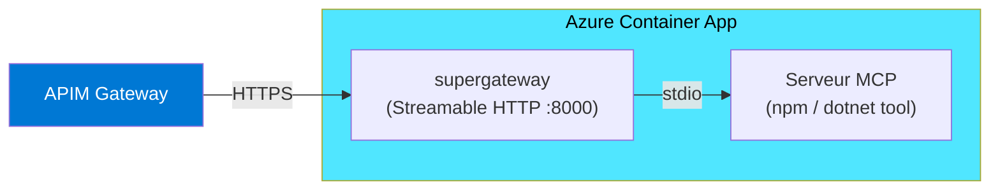

---

## 3. Modèle de sécurité

### 3.1 Authentification multi-couches

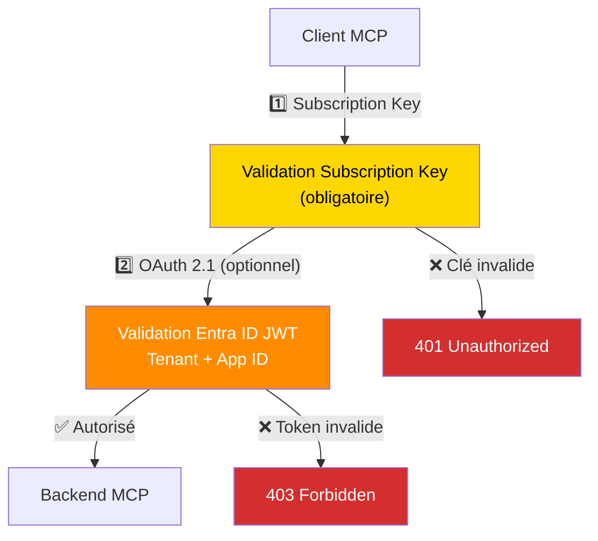

| Couche | Mécanisme | Statut | Détails |
|--------|-----------|:------:|---------|
| **Subscription Key** | `Ocp-Apim-Subscription-Key` | ✅ Actif | Obligatoire sur toutes les APIs. Clé liée au profil. |
| **Entra ID OAuth 2.1** | `validate-azure-ad-token` | ⏸️ Prêt | Configurable par Named Values. Valide issuer, tenant, app ID. |
| **Managed Identity** | `authentication-managed-identity` | ✅ Actif | APIM → Azure OpenAI (SystemAssigned MI, scope `cognitiveservices.azure.com`) |

### 3.2 Durcissement TLS

Configuré au niveau APIM via `customProperties` Bicep :

| Paramètre | Valeur |
|-----------|--------|
| SSL 3.0 | ❌ Désactivé |
| TLS 1.0 | ❌ Désactivé |
| TLS 1.1 | ❌ Désactivé |
| TLS 1.2+ | ✅ Actif |
| HTTP/2 | ✅ Activé |
| TripleDES 168 | ❌ Désactivé |
| RSA CBC (AES 128/256, SHA/SHA256) | ❌ Désactivé |

### 3.3 Rate Limiting

| API | Mécanisme | Clé | Seuil |
|-----|-----------|-----|-------|
| Serveurs MCP | `rate-limit-by-key` | `Mcp-Session-Id` (fallback: IP) | 60 req/min |
| Azure OpenAI | `llm-token-limit` | Subscription ID | 10 000 tokens/min |

Le rate limiting empêche les abus par session MCP individuelle ou par abonnement.

---

## 4. Gouvernance et Whitelist

### 4.1 Modèle deny-by-default

Tous les serveurs MCP sont soumis à un **registre de whitelist** versionné dans Git. Seuls les serveurs explicitement approuvés peuvent être déployés.

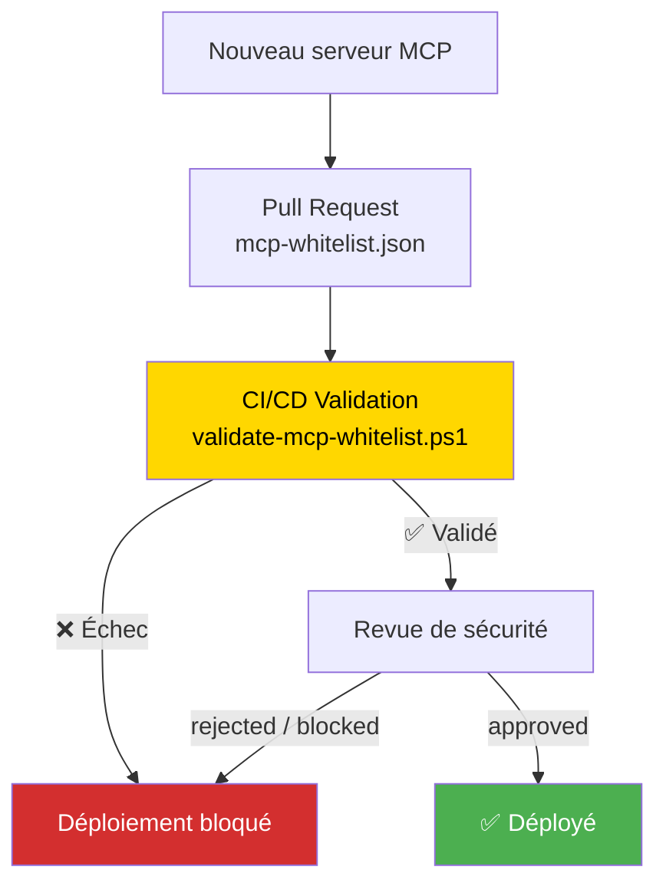

### 4.2 Politiques de gouvernance

| Politique | Valeur | Description |
|-----------|--------|-------------|
| `defaultAction` | `deny` | Tout serveur non listé est refusé |
| `requireSecurityReview` | `true` | Revue de sécurité obligatoire |
| `maxReviewValidityDays` | `180` | Les revues expirent après 6 mois |
| `autoBlockOnExpiredReview` | `true` | Blocage automatique si revue expirée |
| `allowUnreviewedInDev` | `false` | Pas d'exception en environnement dev |
| `notifyOnExpiringSoon` | `30 jours` | Alerte 30 jours avant expiration |

### 4.3 Statut des serveurs approuvés

| Serveur | Éditeur | Source | Risque | Revue | Prochaine revue |
|---------|---------|--------|:------:|:-----:|:---------------:|
| mslearn-mcp | Microsoft | Service managé | 🟢 Low | ✅ Approuvé | Sept. 2026 |
| custom-mcp | Sense of Tech | Interne | 🟢 Low | ✅ Approuvé | Août 2026 |
| aoai-api | Microsoft | Service managé | 🟢 Low | ✅ Approuvé | Sept. 2026 |
| github-mcp | GitHub (OSS) | npm | 🟡 Medium | ✅ Approuvé | Août 2026 |
| azuredevops-mcp | Microsoft (OSS) | npm | 🟡 Medium | ✅ Approuvé | Août 2026 |
| terraform-mcp | HashiCorp (OSS) | npm | 🟢 Low | ✅ Approuvé | Sept. 2026 |
| snyk-mcp | Snyk (OSS) | npm | 🟡 Medium | ✅ Approuvé | Sept. 2026 |
| fluentui-blazor-mcp | Microsoft (OSS) | npm | 🟢 Low | ✅ Approuvé | Sept. 2026 |

### 4.4 Validations automatiques CI/CD

Le script `validate-mcp-whitelist.ps1` vérifie automatiquement :

| Contrôle | Description |
|----------|-------------|
| Approbation serveur | Chaque serveur dans `mcp-servers.json` doit exister dans `approvedServers` |
| Serveurs bloqués | Les serveurs dans `blockedServers` sont rejetés immédiatement |
| Statut revue | Le statut doit être `approved` ou `conditional` |
| Expiration revue | Les revues expirées bloquent le déploiement |
| Rate limits | Les limites configurées ne peuvent pas dépasser les maximums du whitelist |
| Restrictions profils | Les assignations de profils respectent `allowedProfiles` |
| Cohérence primitives | Configuration `mcpPrimitives` validée (allowList ↔ `allowed`, denyList ↔ `denied`) |

---

## 5. Filtrage des primitives MCP

Au-delà du contrôle serveur (approved/blocked), le gateway applique un **filtrage granulaire** sur les primitives MCP au niveau de l'APIM policy (inspection du corps JSON-RPC).

### 5.1 Mécanisme

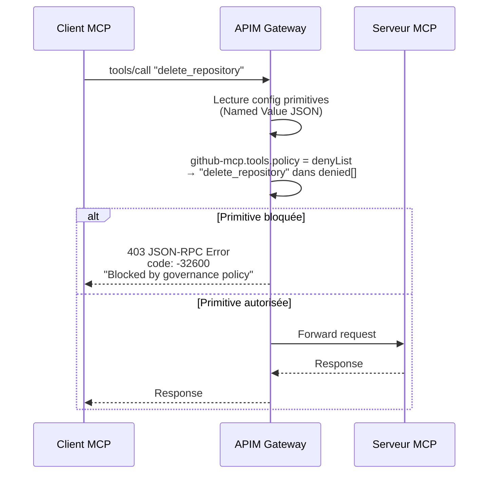

### 5.2 Politiques configurées par serveur

| Serveur | Tools | Prompts | Resources |
|---------|-------|---------|-----------|
| **github-mcp** | `denyList` : `delete_repository`, `delete_branch`, `delete_file` | `allowAll` | `allowAll` |
| **azuredevops-mcp** | `allowList` : lecture seule (9 tools autorisés) | `allowAll` | `denyList` : `secret://*` |
| **Autres serveurs** | `allowAll` (défaut) | `allowAll` (défaut) | `allowAll` (défaut) |

> **Note :** Les méthodes de découverte (`tools/list`, `prompts/list`, `resources/list`) ne sont jamais filtrées — la liste complète reste visible. Seule l'**exécution** est bloquée.

### 5.3 Support des wildcards

Le filtrage supporte les patterns wildcard en fin de chaîne :
- `delete_*` → bloque tous les tools commençant par `delete_`
- `secret://*` → bloque toutes les URIs commençant par `secret://`

---

## 6. Contrôle d'accès par profils

L'accès aux APIs MCP est segmenté par **profils** (APIM Products), chacun avec sa propre subscription key.

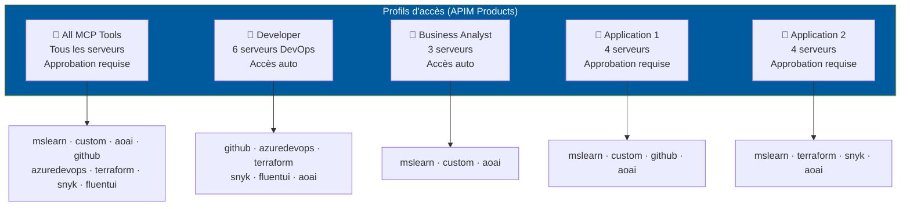

| Profil | Serveurs inclus | Approbation | Abonnements max |
|--------|----------------|:-----------:|:---------------:|
| All MCP Tools | Tous (wildcard `*`) | ✅ Requise | 5 |
| Developer | 6 serveurs | ❌ Auto | 10 |
| Business Analyst | 3 serveurs | ❌ Auto | 10 |
| Application 1 | 4 serveurs | ✅ Requise | 5 |
| Application 2 | 4 serveurs | ✅ Requise | 5 |

Le whitelist applique également des restrictions `allowedProfiles` par serveur : un serveur ne peut être ajouté qu'aux profils autorisés dans sa configuration.

---

## 7. Observabilité et traçabilité

### 7.1 Architecture de monitoring

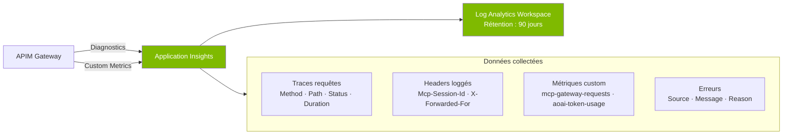

### 7.2 Données tracées

| Catégorie | Détails | Source Policy |
|-----------|---------|:------------:|
| **Requêtes** | Méthode, chemin, code status, durée | `global-policy` |
| **Sessions MCP** | `Mcp-Session-Id`, IP client | `mcp-passthrough` |
| **Métriques requêtes** | Compteur par API, Subscription, IP, Operation | `emit-metric` |
| **Métriques tokens** | Usage tokens (prompt + completion) par modèle, souscription | `emit-metric` (AOAI) |
| **Erreurs** | Message, raison, API source | `on-error` trace |
| **Corps requête** | Loggé (jusqu'à 8 KB) pour debug | App Insights config |
| **Corps réponse** | **Non loggé** (0 bytes) — nécessaire pour le streaming MCP | App Insights config |

### 7.3 Sampling

| Paramètre | Valeur |
|-----------|--------|
| Taux d'échantillonnage | **100%** (toutes les requêtes capturées) |
| Rétention | 90 jours |
| Requêtes avancées | KQL via Log Analytics |

### 7.4 Exemples de requêtes KQL

```kql
// Requêtes MCP par session (timeline)
requests
| where customDimensions["API ID"] != ""
| summarize count() by tostring(customDimensions["Mcp-Session-Id"]), bin(timestamp, 1h)
| render timechart

// Usage de tokens Azure OpenAI par souscription
customMetrics
| where name == "Total Tokens"
| summarize sum(value) by tostring(customDimensions["Subscription ID"]), bin(timestamp, 1d)
| render columnchart

// Taux d'erreur par API
requests
| where resultCode >= 400
| summarize Errors=count() by name, bin(timestamp, 1h)
| render timechart
```

---

## 8. Intégration GitHub Copilot — MCP Registry

Le gateway génère des fichiers **MCP Registry v0.1** par profil, compatibles avec le système d'allowlisting MCP de GitHub Copilot (Business/Enterprise).

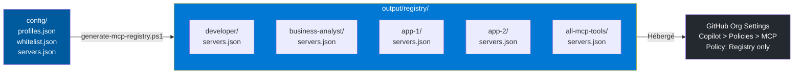

Chaque équipe peut se voir attribuer un registre différent, contrôlant précisément les serveurs MCP accessibles dans Copilot.

---

## 9. Infrastructure as Code

L'ensemble de l'infrastructure est défini en **Bicep** (Azure Resource Manager), versionné dans Git, et déployable via CI/CD.

### 9.1 Modules Bicep

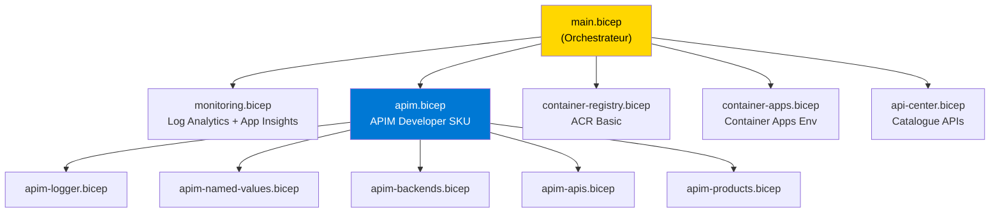

### 9.2 Pipeline CI/CD

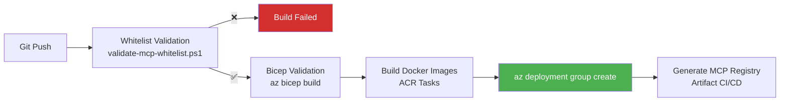

Le pipeline utilise **OIDC federation** pour une authentification sans mot de passe vers Azure.

En environnement `prod`, le mode `--Strict` est activé : les warnings sont traités comme des erreurs.

---

## 10. Résumé des contrôles de sécurité

| # | Contrôle | Implémentation | Statut |
|:-:|----------|---------------|:------:|
| 1 | **Authentification** | Subscription Key obligatoire + Entra ID optionnel | ✅ |
| 2 | **Authorization** | Profils (APIM Products) avec ségrégation des serveurs | ✅ |
| 3 | **Chiffrement en transit** | TLS 1.2+ uniquement, ciphers faibles désactivés | ✅ |
| 4 | **Rate Limiting** | Par session MCP (60/min) + par tokens AOAI (10K/min) | ✅ |
| 5 | **Whitelist serveurs** | Deny-by-default, revue sécurité obligatoire | ✅ |
| 6 | **Expiration des revues** | Auto-blocage après 180 jours, alerte à J-30 | ✅ |
| 7 | **Filtrage primitives** | Blocage tools destructeurs, allowList en lecture seule | ✅ |
| 8 | **Managed Identity** | APIM → Azure OpenAI (pas de clé API) | ✅ |
| 9 | **Traçabilité** | 100% des requêtes tracées (App Insights) | ✅ |
| 10 | **Rétention logs** | 90 jours en Log Analytics | ✅ |
| 11 | **Validation CI/CD** | Whitelist validée avant chaque déploiement | ✅ |
| 12 | **CORS** | Origines restreintes (localhost, vscode.dev, portal.azure.com) | ✅ |
| 13 | **HTTP/2** | Activé | ✅ |
| 14 | **Serveurs bloqués** | Liste noire avec raison et date | ✅ |
| 15 | **Secrets** | Variables sensibles dans Container Apps Secrets (jamais en clair) | ✅ |

---

## 11. Points d'attention et recommandations

### Activations recommandées pour la production

| Action | Priorité | Description |
|--------|:--------:|-------------|
| Activer Entra ID OAuth 2.1 | 🔴 Haute | Décommenter `validate-azure-ad-token` dans les policies XML |
| APIM SKU Standard/Premium | 🔴 Haute | Quitter le SKU Developer (pas de SLA) |
| VNet Integration | 🟡 Moyenne | Isoler APIM et Container Apps dans un réseau virtuel |
| Key Vault pour secrets | 🟡 Moyenne | Remplacer les secrets inline par des références Key Vault |
| Managed Identity pour ACR | 🟡 Moyenne | Remplacer admin credentials par MI Container Apps → ACR |
| Custom domain + certificat | 🟠 Basse | Domaine personnalisé avec certificat TLS géré |
| WAF / Front Door | 🟠 Basse | Ajouter une couche de protection DDoS et WAF |

---

*Document généré le 15 mars 2026 — Projet APIM MCP AI Gateway*
